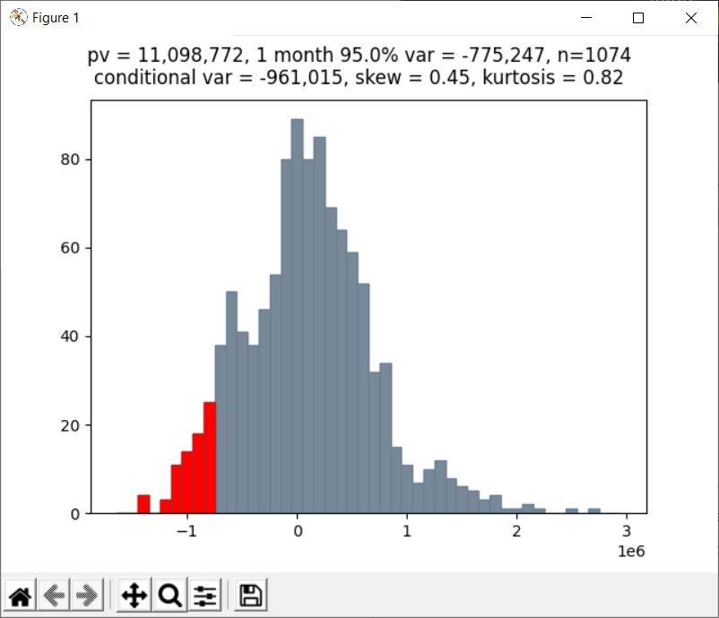

# historicalVAR

Calculation of historical 1-month Value at Risk of a cashflow profile discounted by the UK Gilt Curve.  Histocial scenarios are calculated from trailing 1-month (20 business days) shifts in the yield curve.  Underlying market data sourced from the Bank of England public data repository.

