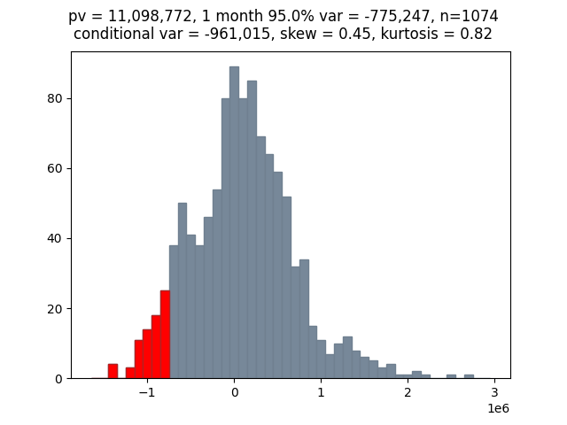

# historicalVAR

Calculation of historical 1-month Value at Risk of a cashflow profile discounted by the UK Gilt Curve.  Histocial scenarios are calculated from trailing 1 month shifts in the yield curve.  Underlying market data sourced from the Bank of England public data repository.

Data files of the form,

cashflows.csv
paydate,amount
31/12/2030,500000
31/12/2040,1000000
31/12/2041,1000000
31/12/2051,500000
31/12/2055,10000000
....

curves.csv
tenor,rate,indexname
1y,0.05,GILT
2y,0.03,GILT
3y,0.04,GILT
4y,0.05,GILT
5y,0.06,GILT
......

scenarios.csv
scenariodate,1y,2y,3y,4y,5y,6y,7y,8y,9y,10y,12y,15y,20y,30y,40y,50y
02/02/2016,-0.064,-0.244,-0.314,-0.342,-0.349,-0.347,-0.341,-0.332,-0.323,-0.314,-0.298,-0.277,-0.253,-0.224,-0.206,-0.206
03/02/2016,-0.067,-0.254,-0.333,-0.368,-0.381,-0.382,-0.378,-0.370,-0.361,-0.352,-0.334,-0.311,-0.285,-0.258,-0.242,-0.242
04/02/2016,-0.022,-0.175,-0.245,-0.272,-0.275,-0.266,-0.252,-0.236,-0.221,-0.208,-0.190,-0.175,-0.165,-0.148,-0.137,-0.137
05/02/2016,-0.025,-0.171,-0.237,-0.264,-0.271,-0.266,-0.255,-0.243,-0.231,-0.220,-0.205,-0.195,-0.190,-0.174,-0.162,-0.162
......

