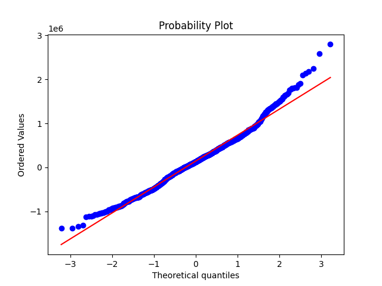

# Historical VAR

Calculation of historical 1-month Value at Risk of a cashflow profile discounted by the UK Gilt Curve together with the Conditional VAR (average of those observations below the standard VAR number).  Historical scenarios are calculated from trailing 1-month (20 business days) shifts in the yield curve.  Underlying market data sourced from the Bank of England public data repository.  Skewness and Kurtosis measurements here indicate the distribution is far from normal suggesting the limiting factor sometimes of this approach to risk measurement.  This is highlighted further in the ProbPlot (or QQ) plot below where the points away from the line indicates the distribution is not normal

